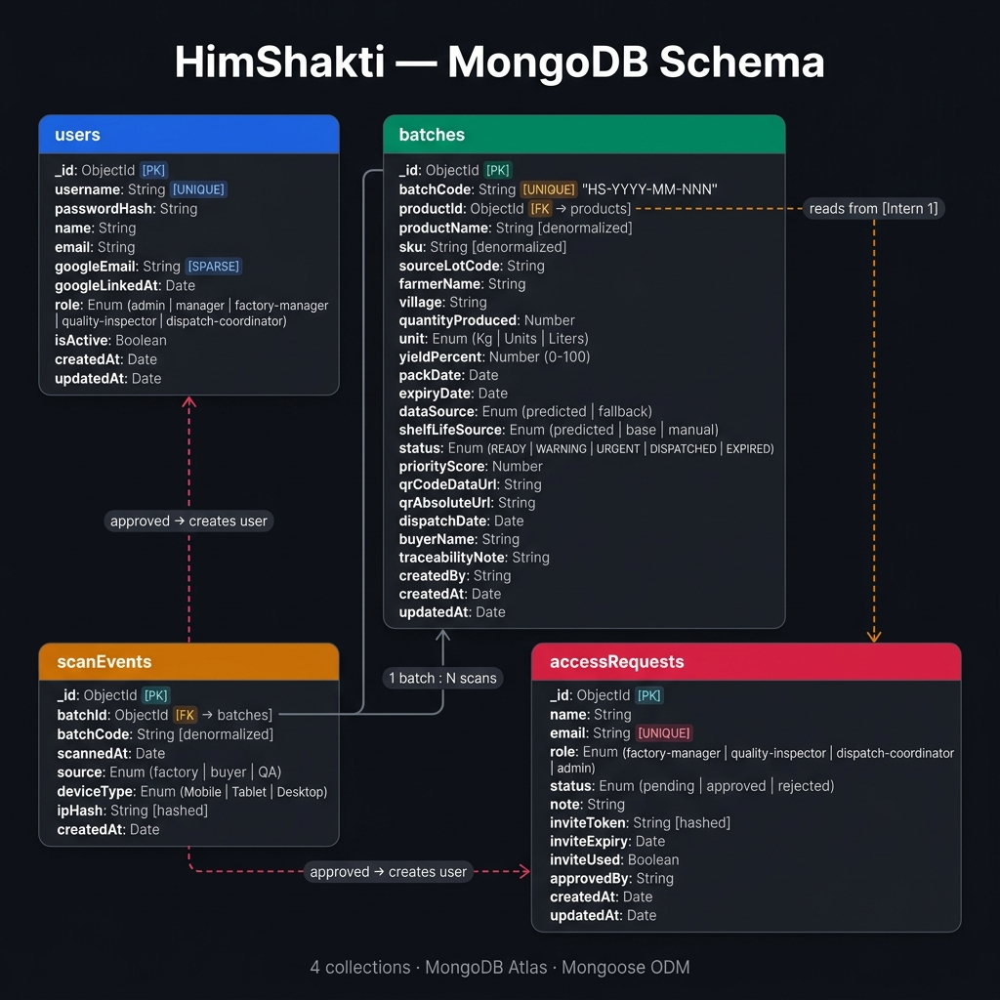

<div align="center">

# 🗄️ HimShakti — Database Design & Schema Reference

<p align="center">
  
  
  
  
</p>

*Batch Traceability · QR Management · Dispatch Intelligence*

</div>

---

## 📑 Table of Contents

- [Why MongoDB?](#-why-mongodb)
- [Schema Diagram](#-schema-diagram)
- [Collections Overview](#-collections-overview)
- [Full Schema Reference](#-full-schema-reference)
  - [users](#-users-collection)
  - [batches](#-batches-collection)
  - [scanEvents](#-scanevents-collection)
  - [accessRequests](#-accessrequests-collection)
- [Indexes & Performance](#-indexes--performance)
- [Relationships & Design Decisions](#-relationships--design-decisions)
- [FEFO Priority Algorithm](#-fefo-priority-algorithm)
- [Data Integrity Constraints](#-data-integrity-constraints)
- [Setting Up the Database](#-setting-up-the-database)
- [Seeding Demo Data](#-seeding-demo-data)

---

## 🤔 Why MongoDB?

HimShakti's data model has **three characteristics** that make MongoDB the right choice over a relational database:

### 1. Schema Flexibility for Batch Diversity

Different product types (wild berries vs. Himalayan salt vs. fruit preserves) have different production attributes. MongoDB's document model lets each batch carry product-specific metadata without forcing a sparse relational table with hundreds of nullable columns.

### 2. Embedded Denormalization for Immutable Audit Trails

The core requirement is **immutability** — once a batch is created, its product name, SKU, farmer name, and village must never change even if the source product record is updated. In MongoDB, we deliberately *denormalize* these fields directly into the `batches` document:

```
batch.productName  ← copied at creation time, never joined live
batch.sku          ← same
batch.farmerName   ← same
batch.village      ← same
```

This would be an anti-pattern in SQL (violating 3NF), but it is the **correct choice for traceability** — it matches how physical batch records work in regulated food supply chains (FDA 21 CFR Part 11, FSSAI traceability requirements).

### 3. QR Payload Storage

Each batch generates a 300×300 PNG QR code stored as a `base64` Data URL (~8–12 KB). MongoDB documents support up to 16 MB — no separate blob store or S3 bucket needed at this scale.

### 4. Operational Simplicity

MongoDB Atlas free tier provides:
- Managed backups
- Auto-scaling
- Connection pooling
- Built-in monitoring

vs. the operational overhead of running PostgreSQL on a VPS for a single-intern prototype.

### Trade-offs Acknowledged

| Trade-off | SQL Would Give | Our Mitigation |
|---|---|---|
| No foreign key enforcement | Referential integrity | Mongoose validators + application-level checks |
| Denormalization drift | Automatic JOIN consistency | Schema snapshot at creation, documented contract |
| Full-text search | Pg `tsvector` | `$regex` search sufficient at current scale |

---

## 📐 Schema Diagram

> Full entity-relationship diagram showing all 4 collections, their fields, data types, and relationships.



### Relationship Legend

```
──────────────   Solid line     = hard reference (ObjectId FK)
╌╌╌╌╌╌╌╌╌╌╌╌   Dashed line    = soft/logical relationship
1 ──────────<   Crow's foot     = one-to-many
```

| Relationship | Type | Description |
|---|---|---|
| `batches.productId` → `products._id` | Soft ref (cross-intern) | Reads product metadata at batch creation time; denormalized immediately |
| `scanEvents.batchId` → `batches._id` | Hard ref | Every QR scan creates one `ScanEvent` pointing to the scanned batch |
| `accessRequests` → `users` | Logical | Admin approval of an `AccessRequest` creates a new `User` document |

---

## 📦 Collections Overview

| Collection | Documents (typical) | Owner | Access Pattern |
|---|---|---|---|
| `users` | 5–20 | Intern 2 | Auth on every request (indexed by `username`) |
| `batches` | 20–500 | Intern 2 | Filtered list, FEFO sort, status updates |
| `scanEvents` | 0–N per batch | Intern 2 | Append-only; read for trace analytics |
| `accessRequests` | 0–50 | Intern 2 | Admin panel read/write; invite flow |
| `products` | N/A | **Intern 1** | **Read-only** by Intern 2 |

> ⚠️ **Schema Contract**: The `products` collection is owned by Intern 1. Changes to its shape require 24-hour written notice. See [`shared/README.md`](../shared/README.md).

---

## 📋 Full Schema Reference

### 👤 `users` Collection

Stores all platform users. Created either by the seed script (admin/manager) or by admin approval of an `AccessRequest`.

```javascript
{
  _id:            ObjectId,           // Auto-generated primary key
  username:       String,             // UNIQUE, lowercase — used for login
  passwordHash:   String,             // bcrypt hash (10 rounds) — never stored plain
  name:           String,             // Display name e.g. "Priya Sharma"
  email:          String,             // Notification email (optional)

  // ── Google SSO (optional) ─────────────────────────────────
  googleEmail:    String | null,      // SPARSE UNIQUE — linked Google account
  googleLinkedAt: Date   | null,      // When the link was established

  // ── Role-Based Access Control ─────────────────────────────
  role: Enum [
    'admin',                // Full access — user management, all ops
    'manager',              // Batch ops, dispatch, AI audit — no user admin
    'factory-manager',      // Create batches only
    'quality-inspector',    // Read batches, view QR
    'dispatch-coordinator'  // Dispatch operations only
  ],

  isActive:   Boolean,    // Soft-delete: false = login denied
  createdAt:  Date,       // Auto (Mongoose timestamps)
  updatedAt:  Date        // Auto (Mongoose timestamps)
}
```

**Indexes:**
- `username: 1` — unique, primary login lookup
- `googleEmail: 1` — sparse unique, Google SSO lookup

---

### 📦 `batches` Collection

The **core collection**. Each document represents one production batch from farmer intake through dispatch. Immutable after creation (status/dispatch fields are the only mutable fields post-creation).

```javascript
{
  _id:      ObjectId,   // Auto-generated primary key

  // ── Cross-Intern Product Reference ───────────────────────
  productId:    ObjectId,  // Soft ref to products._id (Intern 1's collection)
  productName:  String,    // Denormalized snapshot — immutable after creation
  sku:          String,    // Denormalized snapshot — e.g. "WB-500G"

  // ── Raw Material Traceability ─────────────────────────────
  sourceLotCode: String,   // Farmer intake lot — e.g. "LOT-WB-2026-045"
  farmerName:    String,   // e.g. "Ramesh Thakur"
  village:       String,   // e.g. "Munsiyari"

  // ── Production Metrics ────────────────────────────────────
  quantityProduced: Number,            // Min: 1
  unit: Enum ['Kg', 'Units', 'Liters'],
  yieldPercent: Number,                // 0–100 — processing efficiency

  // ── Batch Identity ────────────────────────────────────────
  batchCode: String,    // UNIQUE — format: "HS-YYYY-MM-NNN" e.g. "HS-2026-06-001"

  // ── Shelf Life & Dates ────────────────────────────────────
  packDate:   Date,     // When packaged
  expiryDate: Date,     // Computed by expiryCalculator.js

  dataSource: Enum ['predicted', 'fallback'],
  // 'predicted' = Gemini AI prediction used
  // 'fallback'  = product's default shelf life used (Gemini unavailable)

  shelfLifeSource: Enum ['predicted', 'base', 'manual'],
  // 'predicted' = AI model predicted
  // 'base'      = product's base shelf life from Intern 1's data
  // 'manual'    = operator overrode the expiry

  // ── Status & FEFO Priority ────────────────────────────────
  status: Enum ['READY', 'WARNING', 'URGENT', 'DISPATCHED', 'EXPIRED'],
  // READY     = >30 days to expiry
  // WARNING   = 8–30 days to expiry
  // URGENT    = <=7 days to expiry
  // DISPATCHED = sent to buyer
  // EXPIRED   = past expiry date

  priorityScore: Number,
  // Higher = dispatch sooner. See FEFO Priority Algorithm section.

  // ── QR Code ──────────────────────────────────────────────
  qrCodeDataUrl: String,   // base64 PNG Data URL (300x300) — embedded in card
  qrAbsoluteUrl: String,   // Public trace URL e.g. "http://localhost:5001/trace/HS-2026-06-001"

  // ── Dispatch ─────────────────────────────────────────────
  dispatchDate: Date   | null,   // Set when status -> DISPATCHED
  buyerName:    String | null,   // e.g. "Organic Valley Distributors"

  // ── Audit Trail ──────────────────────────────────────────
  traceabilityNote: String,   // Auto-generated summary
  createdBy:        String,   // username of the creating user

  createdAt: Date,   // Auto
  updatedAt: Date    // Auto
}
```

**Indexes:**
| Index | Fields | Purpose |
|---|---|---|
| Primary | `_id` | Default |
| Unique | `batchCode: 1` | Prevent duplicate batch codes |
| Compound | `status: 1, expiryDate: 1` | FEFO queue queries (filter by status, sort by expiry) |
| Single | `sku: 1` | Filter by product type |
| Single | `productId: 1` | Look up all batches for a product |

---

### 📡 `scanEvents` Collection

**Append-only** audit log. Every time a consumer or staff member scans a batch QR code (hits `/trace/:batchCode`), a `ScanEvent` is created. Never updated or deleted.

```javascript
{
  _id:        ObjectId,   // Auto-generated

  batchId:    ObjectId,   // Hard ref -> batches._id
  batchCode:  String,     // Denormalized — avoids lookup on read

  scannedAt:  Date,       // Defaults to Date.now()

  source: Enum ['factory', 'buyer', 'QA'],
  // Determined by scan context

  deviceType: Enum ['Mobile', 'Tablet', 'Desktop', 'Unknown'],
  // Detected from User-Agent string

  ipHash: String,
  // SHA-256 of the scanner's IP — never stored in plain text (NFR-2.3)
  // Enables "scanned from how many unique locations?" analytics without PII

  createdAt:  Date    // Auto
}
```

**Indexes:**
| Index | Fields | Purpose |
|---|---|---|
| Single | `batchId: 1` | Look up all scans for a batch |
| Compound | `batchId: 1, scannedAt: -1` | Paginated scan history, most recent first |

---

### 🔐 `accessRequests` Collection

Manages the onboarding workflow: new users submit a request → admin reviews → invite email sent → user sets password via secure link.

```javascript
{
  _id:    ObjectId,   // Auto-generated

  name:   String,     // Applicant's full name
  email:  String,     // UNIQUE — prevents duplicate requests per email

  role: Enum [
    'factory-manager',
    'quality-inspector',
    'dispatch-coordinator',
    'admin'
  ],

  status: Enum ['pending', 'approved', 'rejected'],
  // Default: 'pending'

  note: String,         // Admin's rejection reason (optional)

  // ── Secure Invite Link ────────────────────────────────────
  inviteToken:  String,    // SHA-256 hash of the raw token sent in email
  inviteExpiry: Date,      // Token expires 72 hours after generation
  inviteUsed:   Boolean,   // True once user has set their password

  approvedBy:   String,    // username of approving admin

  createdAt: Date,   // Auto
  updatedAt: Date    // Auto
}
```

**State Machine:**

```
[submitted]
     |
     v
  pending ---- admin rejects ----> rejected (with note)
     |
  admin approves
     |
     v
  approved --> invite email sent --> inviteToken hashed & stored
                                         |
                                   user clicks link & sets password
                                         |
                                   User document created in `users`
                                   inviteUsed = true
```

---

## ⚡ Indexes & Performance

### Compound Index Strategy

The most frequent production query is the **FEFO queue** — "give me all non-dispatched batches, sorted by who expires soonest":

```javascript
// Query:
db.batches.find({ status: { $in: ['READY', 'WARNING', 'URGENT'] } })
          .sort({ expiryDate: 1 });

// Served by compound index:
BatchSchema.index({ status: 1, expiryDate: 1 });
```

Without this index, MongoDB would do a collection scan on every dashboard load.

### Index Summary

| Collection | Index | Type | Cardinality |
|---|---|---|---|
| `users` | `username` | Unique B-tree | Low (5–20 docs) |
| `users` | `googleEmail` | Sparse Unique | Very low |
| `batches` | `batchCode` | Unique B-tree | High (1 per doc) |
| `batches` | `status + expiryDate` | Compound B-tree | Medium |
| `batches` | `sku` | B-tree | Low cardinality |
| `batches` | `productId` | B-tree | Low cardinality |
| `scanEvents` | `batchId` | B-tree | Low per batch |
| `scanEvents` | `batchId + scannedAt` | Compound B-tree | Time-series |
| `accessRequests` | `email` | Unique B-tree | Very low |

---

## 🔗 Relationships & Design Decisions

### Why not embed scanEvents inside batches?

Initially tempting — but embedding would cause:
1. **16 MB document limit** breach if a QR goes viral
2. **Write amplification** — updating a nested array on every scan vs. simple insert
3. **Analytics complexity** — "total scans per day across all batches" requires `$unwind`

A separate `scanEvents` collection with an index on `batchId` is the correct MongoDB pattern for this 1:N relationship.

### Why denormalize productName and SKU into batches?

Two reasons:
1. **Traceability immutability** — if Intern 1 renames a product 6 months later, all historical batches must still show the original name (the name at time of production)
2. **Zero cross-collection joins** — the dashboard batch list can render without a second query

### Why store qrCodeDataUrl in the document?

The QR PNG is ~8–12 KB. At 500 batches, that's ~5 MB total — well within Atlas free tier's 512 MB storage limit. This avoids a separate S3 bucket, file server, or broken images from expired external URLs.

> For scale > 10,000 batches, the right migration would be GridFS or S3, keeping only the URL in the document.

---

## 🧮 FEFO Priority Algorithm

**FEFO = First Expired, First Out**

The `priorityScore` field is computed in [`backend/src/services/expiryCalculator.js`](../backend/src/services/expiryCalculator.js) at batch creation time:

```javascript
// Higher priorityScore = dispatch this batch sooner

function computePriorityScore(daysToExpiry) {
  if (daysToExpiry <= 0)  return 1000;  // Already expired — maximum urgency
  if (daysToExpiry <= 7)  return 500 + (7 - daysToExpiry) * 10;  // URGENT
  if (daysToExpiry <= 30) return 200 + (30 - daysToExpiry) * 5;  // WARNING
  return Math.max(0, 100 - daysToExpiry);                         // READY
}
```

**Status tiers:**

| Status | Days to Expiry | Priority Range | Dashboard Treatment |
|---|---|---|---|
| `URGENT` | ≤ 7 days | 500–570 | 🔴 Red row tint, top of FEFO queue |
| `WARNING` | 8–30 days | 200–310 | 🟡 Yellow, mid-queue |
| `READY` | > 30 days | 0–70 | 🟢 Green, bottom of queue |
| `DISPATCHED` | — | 0 (frozen) | ✅ Removed from FEFO queue |
| `EXPIRED` | < 0 days | 1000 | 🚨 Emergency — past expiry |

---

## 🛡️ Data Integrity Constraints

### Application-Level (Mongoose)

| Field | Constraint | Enforcement |
|---|---|---|
| `batchCode` | Unique, `HS-YYYY-MM-NNN` format | Mongoose unique + `batchCodeGenerator.js` |
| `username` | Unique, lowercase | Mongoose unique + `lowercase: true` |
| `email` (AccessRequest) | Unique | Mongoose unique — prevents duplicate submissions |
| `yieldPercent` | 0–100 | Mongoose `min: 0, max: 100` |
| `quantityProduced` | >= 1 | Mongoose `min: 1` |
| `expiryDate` | > packDate | Application-level check in `batches.controller.js` |
| `passwordHash` | bcrypt 10 rounds | Never stored or logged in plain text |
| `ipHash` | SHA-256 | Never stored in plain text (NFR-2.3) |

### Security Constraints

- **Passwords**: bcrypt with 10 salt rounds — never stored or logged
- **IP addresses**: SHA-256 hashed before storage — GDPR/privacy compliant  
- **Invite tokens**: SHA-256 hashed in DB — raw token only in email link (like a password reset token)
- **Google emails**: sparse unique index prevents duplicate SSO linkage

---

## 🚀 Setting Up the Database

### Option A — MongoDB Atlas (Recommended)

**Step 1: Create a free Atlas account**
```
https://cloud.mongodb.com
```

**Step 2: Create a free M0 cluster**
- Choose a cloud provider (AWS/GCP/Azure) and region closest to you
- M0 = 512 MB storage, free forever — sufficient for this project

**Step 3: Create a database user**
```
Security → Database Access → Add New Database User
  Username: himshakti-admin
  Password: (generate a strong password and save it)
  Role: readWriteAnyDatabase
```

**Step 4: Whitelist your IP**
```
Security → Network Access → Add IP Address
  Development: 0.0.0.0/0 (allow all)
  Production: your server's specific IP
```

**Step 5: Get your connection string**
```
Deployment → Database → Connect → Drivers → Node.js
```
Copy the URI — it will look like:
```
mongodb+srv://himshakti-admin:<password>@cluster0.xxxxx.mongodb.net/
```

**Step 6: Configure your environment**
```bash
# backend/.env
MONGODB_URI=mongodb+srv://himshakti-admin:<password>@cluster0.xxxxx.mongodb.net/himshakti?retryWrites=true&w=majority
```

**Step 7: Start the backend**
```bash
cd backend
npm run dev
```

Expected output:
```
✅ [Intern 2] MongoDB Atlas connected — himshakti DB
✅ [Auth] Users already seeded — skipping.
🚀 [HimShakti] Backend running at http://localhost:5001
```

Mongoose automatically creates the `himshakti` database and all collections + indexes on first run.

### Option B — Local MongoDB

```bash
# Install MongoDB Community Edition:
# https://www.mongodb.com/docs/manual/installation/

# Start MongoDB
mongod --dbpath ./data/db

# Update backend/.env
MONGODB_URI=mongodb://localhost:27017/himshakti
```

### Verify Connection

```bash
curl http://localhost:5001/health
# Expected: { "status": "ok", "db": "connected" }
```

---

## 🌱 Seeding Demo Data

The seed script generates **20 production-quality batches** across all urgency tiers for a realistic demo:

```bash
cd backend
node src/scripts/seedRichData.js
```

**What gets seeded:**

| Category | Count | Expiry Range |
|---|---|---|
| URGENT batches | ~4 | Within 7 days |
| WARNING batches | ~6 | 8–30 days |
| READY batches | ~6 | 30+ days |
| DISPATCHED batches | ~4 | Already sent to buyers |

Each batch includes real QR codes, diverse Uttarakhand farmers and villages, computed priority scores, and auto-generated traceability notes.

**Expected output:**
```
🌱 Starting rich data seed...
✅ Seeded HS-2026-06-001 — Wild Berry Mix (3 days → URGENT)
✅ Seeded HS-2026-06-002 — Himalayan Pink Salt (82 days → READY)
✅ Seeded HS-2026-06-003 — Apricot Preserve [DISPATCHED]
...
✅ 20 batches seeded successfully
```

> ⚠️ Running the seed script twice adds a second set of batches. Drop the `batches` collection in Atlas first for a clean slate.

---

<div align="center">

**HimShakti Food Processing — Database Design Reference**

*MongoDB Atlas · Mongoose 7 · 4 Collections · Intern 2 · 2026*

</div>
